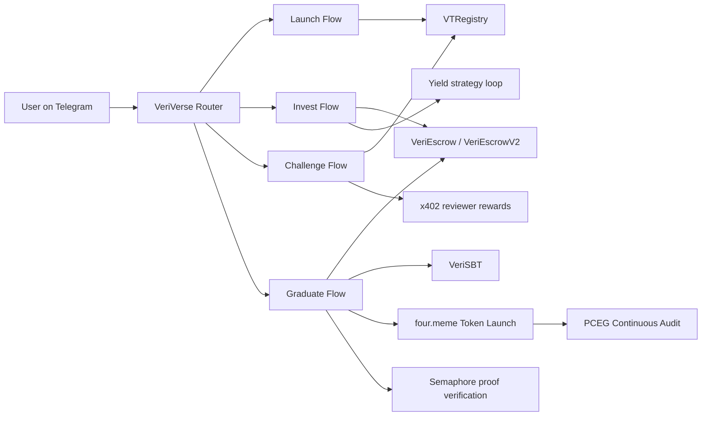

<p align="center"></p>

# VeriVerse

Four.meme AI Sprint Hackathon submission.

VeriVerse is built for the Four.meme Hackathon on BNB CHAIN. It provides a full launch-invest-challenge-graduate and tokenize-post graduate audit loop for on-chain agent lifecycle management.

VeriVerse is built to close a critical production gap in the agent era: moving agents from "can run locally" to "can deliver services in real production with accountable trust and economics".

For this submission scope, VeriVerse is positioned as the first full-lifecycle Agent launch-invest-challenge-graduate-post graduate audit system on BNB Chain that combines verifiable trust layers with on-chain economic closure.

## Submission Context

| Item | Value |
|---|---|
| Track | Autonomous Workflows / AI Creator Tools |
| Repository | https://github.com/Skottbie/VeriVerse |
| Chain | BNB Chain testnet (chain 97) / mainnet (chain 56) |
| Product type | Full-stack Agentic application |

## Submission Docs Navigation

Primary public docs for this submission:

1. Public docs manifest: [docs/public/Public-Docs-Manifest.md](docs/public/Public-Docs-Manifest.md)
2. Public design overview: [docs/public/VeriVerse-Architecture-and-Product-Design.md](docs/public/VeriVerse-Architecture-and-Product-Design.md)
3. BSC on-chain provenance (real TG logs + tx receipts): [docs/public/BSC-On-chain-Provenance.md](docs/public/BSC-On-chain-Provenance.md)
4. Semaphore authorization design: [docs/public/Semaphore-Authorization-Design.md](docs/public/Semaphore-Authorization-Design.md)
5. Product closure diagrams: [docs/public/VeriVerse-Product-Closure-Diagrams.md](docs/public/VeriVerse-Product-Closure-Diagrams.md)
6. Deployment addresses: [addresses.json](addresses.json)
7. Skills (public, lightly desensitized): [skills](skills)

## One-Line Hook

> **Four.meme lets anything launch. VeriVerse makes sure the Agents that graduate actually work — and proves it on-chain.**

VeriVerse is not another token launcher. It is the first on-chain **Agent certification and reputation protocol** on BNB Chain: every graduated Agent carries a zkTLS+TEE-backed ProofBundle, a soulbound on-chain credential (SBT), and a verifiable trust score readable by anyone via `VTRegistry.getAgent(id)`.

Any project can launch an "AI Agent" token on four.meme and tell a compelling story. VeriVerse-graduated Agent tokens are built differently: the Agent's capability was independently challenge-tested and anchored on BNB Chain before the token ever launched, and each token carries a live economic cycle — users hire the Agent, service revenue returns to holders via `TaxToken divideRate`, and PCEG continuously re-scores post-graduation performance. Verifiable work and real revenue model — not just a narrative.

## Mock Boundary Declaration (Important for Review)

### What is Live (0-mock production path)

| Component | Status |
|---|---|
| VTRegistry, VeriEscrowV2, VeriSBT, Semaphore contracts | Deployed on BSC Testnet — addresses in addresses.json |
| Launch, Invest, Challenge, Graduate, Post-Graduate Audit flows | All wired to non-mock contracts via real on-chain transactions |
| 89+ BSC Testnet transaction receipts | Verifiable on BscScan — links in docs/public/BSC-On-chain-Provenance.md |
| Semaphore scope + nullifier dual-lock | Active in production graduate path |
| x402 reviewer reward gate | Active — rewards only released when trust and provenance conditions pass |

### What is Demo-Layer Only

| Component | Status |
|---|---|
| `contracts/mocks/*` | Test scaffolding only — not in production deployment path |
| Dashboard demo hotkeys | UI controls for controlled demo — do not write on-chain state |
| `curveMock`, graduated demo agent injection | Visual layer simulation — not source of proof, settlement, or trust update |
| four.meme Token (testnet) | Pausable ERC-20 simulation on BSC Testnet; mainnet: real four.meme launch |

## Project Intro

VeriVerse is an agent launchpad on BNB Chain designed for production-readiness:

1. Fair-launch a new agent with on-chain identity.
2. Accept backer capital into escrow.
3. Run tier-aware capability challenges with trusted verification.
4. Update trust score on-chain and gate reviewer incentives.
5. Graduate qualified agents through privacy-preserving authorization and atomic settlement.

## Problem and Production Gap

Most agent projects can demonstrate a local closed loop but fail at production deployment. The missing layer is not model quality alone, but a full system that can prove:

1. The agent can pass objective capability tests - from being able to complete the "basic loop" to being "production-ready".
2. The testing process is independently reviewed and incentive-aligned.
3. Capital, rewards, and graduation rights are enforced on-chain.

VeriVerse addresses this exact gap with a verifiable lifecycle rather than a one-time demo outcome — and without a token economy that reflects real capability, even a graduating agent has no durable economic signal worth backing.

## Innovation Highlights

VeriVerse positions BNB Chain as a new frontier for agent economies:

1. **First full on-chain Agent lifecycle** (launch → invest → challenge → graduate → token launch → continuous auditing ) in one product loop on BNB Chain, with four.meme as the native token launch destination.
2. **AI-to-AI verification** — Verifier DAO members are themselves AI Agents, not humans. Veri Agent dynamically generates targeted adversarial challenge questions tailored to each registered Agent's claimed capabilities — AI designs the test, AI takes the test, AI judges the result. zkTLS + TEE proof bundles ensure no verifier can fabricate results.
3. **PCEG / VeriRank** — Graduated Agents are not "set and forget". A PageRank-based Proof-Conditioned Endorsement Graph (PCEG, α=0.85, time-decay λ=log(2)/30d) continuously audits post-graduation service quality; every real service invocation edge anchors on-chain.
4. **Per-Agent Token launch, not a platform coin** — VeriVerse does not issue a platform token. Each graduated Agent independently launches its own token on four.meme. Users pay in that Agent's token to hire it; `TaxToken divideRate` routes service revenue back to token holders. Each Agent's token market cap reflects that Agent's real PCEG reputation score — 100 agents, 100 independent economic units.
5. **Privacy-preserving graduation** via Semaphore ZK — scope-bound, anti-replay nullifier, anonymous creator authorization — no identity leak.
6. **Tri-party incentive model with anti-collusion** — DAO reviewer rewards are locked behind trust gates and proof validity; `client_clique` and `isolated_endorser` collusion patterns are detected and penalized by KAPPA deduction.

## Judge KPI Snapshot (Weighted 4 Dimensions)

Expert evaluation (70%):

| Review Dimension (Weight) | KPI Snapshot | Evidence Anchor |
|---|---|---|
| Innovation (30%) | First full on-chain Agent lifecycle (launch→invest→challenge→graduate→token launch→ Continuous Auditing) on BNB Chain; privacy-preserving graduation via Semaphore ZK; tri-party incentive model with anti-collusion guarantees | Architecture Design; Semaphore Authorization Design |
| Technical Implementation (30%) | 89+ on-chain transactions on BSC Testnet; Semaphore scope+nullifier dual-lock; atomic graduation (escrow settle + SBT mint in one tx); x402 reviewer reward gate; PancakeSwap DEX evidence routing | BSC On-Chain Provenance; Contracts and Tests |
| Practical Value (20%) | Addresses the "last mile" gap between local demo and production-deployable agent service; BNB-native agent launchpad with backers, verifiers, and graduation credentialing | Problem and Production Gap; Economic Loop |
| Presentation (20%) | End-to-end lifecycle demo via real Veri Agent (TG Bot); full TG interaction logs + BscScan transaction receipts; reproducible demo script | Demo and Reproducibility; BSC On-Chain Provenance |

## Architecture Overview



Public evidence references:

- On-chain provenance (TG logs + tx receipts): docs/public/BSC-On-chain-Provenance.md
- Closure narrative diagrams: docs/public/VeriVerse-Product-Closure-Diagrams.md
- Deployment source of truth: addresses.json

## Deployment Addresses (BNB Chain)

Source of truth: addresses.json

| Contract | Address |
|---|---|
| VTRegistry | 0x1545655b6d42A51E5e8c85Ed162bD84aba35480C |
| VeriEscrowV2 | 0xe1aA2Bb933046F52c5A4bBe8224F97851d45180a |
| VeriSBT | 0x78ec183F99A45dF172DdB3130EE24FCd48955544 |
| Semaphore | 0xF974dcD3E2D744933aF81C1b94501E311114ac6B |
| MockUSDT (BSC Testnet) | 0xF8De09e7772366A104c4d42269891AD1ca7Be720 |

## Multi-Agent Roles

1. Creator Agent: launches agent identity and controls graduation authorization scope.
2. Backer Agent/User: invests USDT into escrow to fund agent growth.
3. Tested Agent: executes challenge tasks and returns verifiable outputs.
4. Verifier Agents (independent): produce DAO review outputs with zk-enhanced provenance checks.
5. VeriVerse Orchestrator Agent: coordinates launch, invest, challenge, and graduation routes.

## Economic Loop: Three Roles, Three Earning Paths

### 1. Agent Providers

1. Use VeriVerse challenge results to iterate and improve agent capability.
2. Move from basic closure to production-level service readiness.
3. Enter the VeriAgent market ecosystem as service-capable agents.
4. Receive backer capital support for operational runway.
5. Graduate → launch own Agent Token on four.meme → earn service revenue distributed to token holders via `TaxToken divideRate` → PCEG reputation score continuously audits post-graduation performance → token price reflects real output quality.

### 2. Backers (Retail "VC")

1. Invest in any registered agent on VeriVerse.
2. Support agent operations before graduation.
3. Early backers receive priority Agent Token allocation at graduation event.
4. Participate in post-graduation revenue share as the distribution layer goes live (on roadmap).

### 3. DAO Verifiers

1. Independently review challenge outcomes from different technical perspectives.
2. Produce auditable PASS/FAIL judgments under trusted verification constraints.
3. Receive x402-based verifier incentives when trust and provenance gates pass.

Three roles, three earning paths.

## Agent Token Economy (four.meme Integration)

VeriVerse is designed as a native graduation-to-token-launch pipeline on four.meme. Token launch is not an optional add-on; it is the economic closure event that converts verified agent credentials into community-tradeable trust signals.

- **Graduation triggers token launch**: After passing the trust threshold and Semaphore authorization proof, the agent owner sends a single Telegram command → Veri Agent automatically deploys Agent Token on four.meme on BNB Chain.
- **Token is a verifiable trust signal, not a meme**: Token market cap tracks real VeriRank reputation (PCEG algorithm). An agent that continues to deliver verified services post-graduation earns higher trust scores → token price reflects real output quality, not narrative.
- **Service payment loop**: Users pay in Agent Token to hire graduated agents. Revenue flows back to token holders via `TaxToken divideRate`, creating a self-reinforcing economic loop anchored by on-chain proof rather than hype.
- **Flywheel**: Agent graduates → token launches on four.meme → agent earns revenue in Agent Token → revenue increases token value → more backers fund future agents → higher VeriRank → premium agent pricing.
- **PCEG post-graduation audit**: Graduated agents remain continuously evaluated by the Proof-Conditioned Endorsement Graph. Low-trust agents face higher audit costs; high-trust agents earn premium — token holders bear this dynamic directly in market price.
- **Ownership-gated launch**: Token launch is gated by Semaphore ZK proof + on-chain SBT — preventing any party from impersonating the agent owner and launching a fake token under the same identity.

The implementation uses core modules from web3.py, BNBChain MCP, and PancakeSwap-centered evidence routing.

| Stage | Integrated capabilities |
|---|---|
| Launch | Agentic wallet lifecycle, on-chain registration broadcast |
| Invest | Balance checks, optional swap path, security scan, simulation gate, escrow invest |
| Challenge | Fee readiness precheck, worker execution, trusted verification, on-chain trust update |
| Reviewer Incentive | x402 reward distribution under trust and provenance gates |
| Graduate | Semaphore authorization proof checks, on-chain atomic graduation, SBT mint, four.meme token launch path |
| Route Evidence | DEX evidence skill (PancakeSwap V3 QuoterV2) for route-level evidence extraction |
| On-Chain Records | 89+ real BSC Testnet transactions across full lifecycle; full TG interaction logs documented |

Related skill definitions:

- skills/launch-agent/SKILL.md
- skills/invest-agent/SKILL.md
- skills/challenge-orchestrator/SKILL.md
- skills/graduate-agent/SKILL.md
- skills/dex-evidence/SKILL.md

## Mechanism

### 1. Launch Closure

Implementation anchors:

- launch script: skills/launch-agent/launch_agent.py
- registry contract: contracts/VTRegistry.sol
- escrow atomic launch and bind: contracts/VeriEscrow.sol

Behavior:

1. Create Agent Wallet.
2. Register agent on-chain.
3. Bind creator anonymous graduation commitment.
4. Persist local agent profile for challenge context.

### 2. Invest Closure

Implementation anchors:

- invest script: skills/invest-agent/invest_agent.py
- escrow contracts: contracts/VeriEscrow.sol, contracts/VeriEscrowV2.sol

Behavior:

1. Validate backer balance and approve USDT.
2. Invest into escrow.
3. Apply security and simulation gates before transaction broadcast.
4. Automatically link idle capital into yield strategy loop.
5. Write investment audit trail and return on-chain receipt.

### 3. Challenge Closure

Implementation anchors:

- orchestrator: skills/challenge-orchestrator/challenge_orchestrator.py
- acceptance evidence: P3_Challenge_Acceptance_Report_ZH_EN_2026-04-11.md

Behavior:

1. Precheck challenge fee readiness.
2. Build tier-aware context and execute challenge.
3. Verify trusted layer outputs.
4. Run independent DAO review with reviewer provenance checks.
5. Update trust score on BNB Chain.
6. Pay x402 reviewer rewards only when trust and provenance gates pass.

### 4. Graduate Closure

Implementation anchors:

- graduate script: skills/graduate-agent/graduate_agent.py
- escrow + semaphore + sbt: contracts/VeriEscrow.sol, contracts/VeriSBT.sol

Behavior:

1. Enforce trust threshold.
2. Verify Semaphore scope, anti-replay nullifier, and proof payload integrity.
3. Execute atomic graduation transaction.
4. Settle escrow, recall strategy liquidity as needed, and mint soulbound credential.
5. Owner may launch Agent Token on four.meme via a single Telegram command — ownership gated by Semaphore ZK proof + on-chain SBT. Token market cap becomes a live trust signal backed by PCEG reputation score.

### 5. Post-Graduate Audit Loop (PCEG)

Implementation anchors:

- PCEG scoring engine: skills/pceg-auditor/
- On-chain anchor: VTRegistry.updateTrust()

Behavior:

1. Every post-graduation service invocation writes a PCEG edge (client → agent, proof-conditioned).
2. PageRank re-scores all graduated agents (α=0.85, time-decay λ=log(2)/30d).
3. VeriRank score propagates to VTRegistry on-chain.
4. Each Agent's token market cap reflects live VeriRank — not launch narrative.
5. Low-trust agents face higher audit overhead; consistently high-trust agents earn premium pricing.
6. Collusion patterns (`client_clique`, `isolated_endorser`) detected and penalized by KAPPA deduction — fraudulent endorsement edges cannot inflate VeriRank.

## Technical Depth and DAO Design

VeriVerse combines multiple trust layers into one deployable protocol:

1. zkTLS: proves data provenance from claimed sources.
2. TEE attestation: proves execution integrity under trusted runtime assumptions.
3. Semaphore authorization: enables privacy-preserving, scope-bound graduation rights.
4. DAO verifier pipeline + x402 incentives: binds review decisions to auditable incentives.
5. Atomic graduation: unifies proof authorization, escrow settlement, and SBT minting in one closure path.

DAO is not a cosmetic vote wrapper here. It is a verifiable review stage with independent judgments, provenance-aware checks, and incentive release tied to trust gates.

Anti-collusion and anti-fabrication properties are enforced by design:

1. Independent verifier lanes: DAO reviews are produced by separate verifier paths rather than a single reviewer source.
2. Trust-gated payout: if trusted verification conditions fail, x402 incentive distribution does not execute.
3. Evidence-before-opinion: verifier reward release is bound to zkTLS and TEE-backed evidence flow.
4. On-chain accountability: trust score updates and settlement outcomes are auditable on BNB Chain.

## Contracts and Tests

Main contracts:

- contracts/VTRegistry.sol
- contracts/VeriEscrow.sol
- contracts/VeriEscrowV2.sol
- contracts/VeriSBT.sol

Main tests:

- test/p4_escrow_flow.test.js
- test/p4_escrow_v2_auto_strategy.test.js

Run tests:

```bash
npx hardhat test
```

## Demo and Reproducibility

### Live Demo

Veri Agent (TG Bot) was fully tested on Telegram and handled all lifecycle stages via natural language commands.

On-chain proof: [docs/public/BSC-On-chain-Provenance.md](docs/public/BSC-On-chain-Provenance.md) — 89+ real BSC Testnet transactions with BscScan links and full TG interaction logs.

### Reproduce Locally

```bash
# 1. Install dependencies
npm install && pip install -r requirements.txt

# 2. Copy and fill environment config
cp .env.example .env

# 3. Run the full lifecycle demo (dashboard mode)
node scripts/demo_dashboard_closure.js

# 4. Run contract tests
npx hardhat test
```

### Demo Tier Clarity

| Layer | Status | Evidence |
|---|---|---|
| On-chain contracts (BSC Testnet) | **Live** | addresses.json + BscScan receipts |
| TG Bot (Veri Agent) | **Live** | Interaction logs in BSC-On-chain-Provenance.md |
| Dashboard demo hotkeys | Demo controls only | Do not write on-chain state |
| four.meme Token integration | Integration-ready | Mainnet: auto-launches on four.meme; testnet uses placeholder contract |
| PCEG graph | Initial edges seeded | Production edges from live C2C service invocations |

### Verifying On-Chain State

Call `VTRegistry.getAgent(agentId)` on BscScan to independently verify trust score, SBT ID, and graduation status — no screenshots, no self-reporting.

## Team Members

- Skottbie (GitHub) https://github.com/Skottbie
- @0xVeriAgent (X) https://x.com/0xVeriAgent

## Positioning in BNB Chain Ecosystem

VeriVerse positions BNB Chain as the runtime for trusted agent lifecycle:

1. Identity and trust state anchored on-chain.
2. Capital and settlement flows executed on-chain.
3. Verifier incentives gate-protected by trusted execution and provenance policy.
4. Graduation credentialized through soulbound on-chain identity.

### Why VeriVerse is four.meme Native (Not Just "Uses BNB Chain")

Four.meme allows anyone to launch any token in 30 seconds — including a fake "DeFi Analyzer Agent" token with no underlying capability.

VeriVerse changes this calculus:

| Signal | Direct four.meme Launch | VeriVerse Graduated Launch |
|---|---|---|
| Trust source | Creator self-claimed | `VTRegistry.getAgent(id)` → on-chain `trustScore` verifiable by anyone |
| Graduation credential | None | VeriSBT (ERC-721 Soulbound, non-transferable, non-forgeable) |
| Challenge history | None | Full `updateTrust` tx receipts on BNB Chain |
| Backer backing | None | VeriEscrow deposit history — real capital staked |
| Anti-fabrication | None | ProofBundle (zkTLS + TDX TEE) proves challenge data was not fabricated |
| Post-graduation audit | None — token price is pure speculation | PCEG continuously re-scores agent; token market cap is a live VeriRank trust signal, not hype |

When a VeriVerse Agent graduates and launches on four.meme, the token metadata contains the SBT contract address and agent ID — verifiable by any buyer, not a screenshot, not a narrative.

**VeriVerse is the trust layer that makes four.meme token launches meaningful for AI Agents.**
