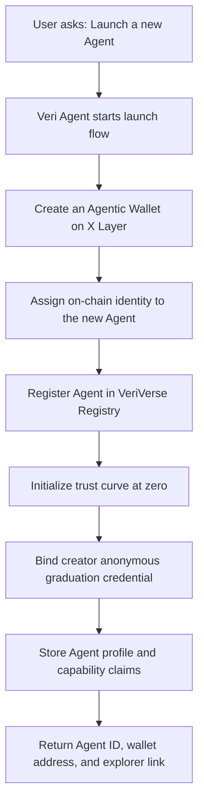
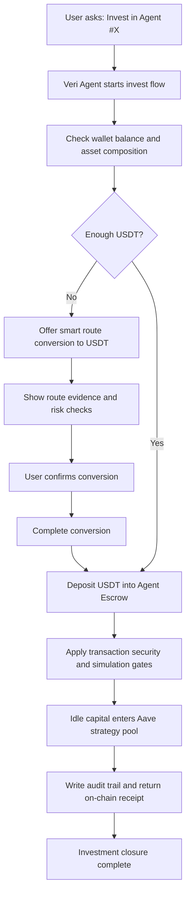
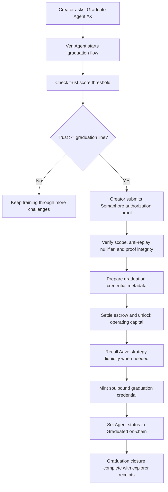
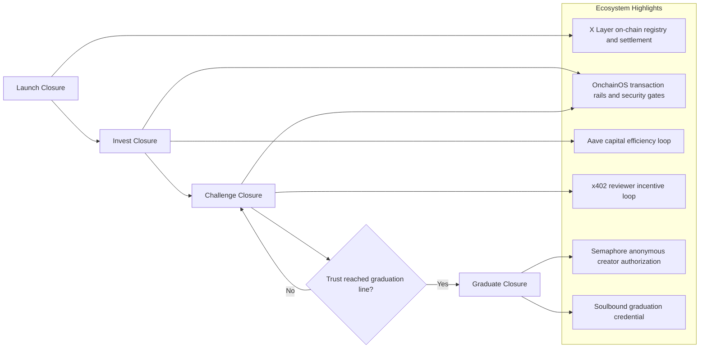

# VeriVerse Product Closure Mermaid Pack (2026-04-15)

This version is written in user-facing language with ecosystem terms only.

Contains:
1. Launch Closure
2. Invest Closure
3. Challenge Closure
4. Graduate Closure
5. Overall Product Closure

---

## 1) Launch Closure



---

## 2) Invest Closure



---

## 3) Challenge Closure

```mermaid
flowchart TD
    U[User asks: Challenge Agent #X] --> VA[Veri Agent starts challenge flow]
    VA --> FEE[Check challenge fee readiness]
    FEE --> READY{Fee ready?}
    READY -- No --> SWAP[Guide conversion path and retry precheck]
    SWAP --> FEE
    READY -- Yes --> CONTEXT[Read Agent claims and current trust tier]

    CONTEXT --> EXAM[Pro reviewer designs tier-aware challenge]
    EXAM --> EXEC[Agent executes task in trusted runtime]
    EXEC --> PROOF[Generate verifiable result bundle]
    PROOF --> TRUST[Trusted layer verifies zkTLS and runtime evidence]

    TRUST --> DAO[Independent DAO reviewers score PASS or FAIL]
    DAO --> PCHK[Check reviewer provenance integrity]
    PCHK --> DECIDE[Finalize verdict and trust delta]
    DECIDE --> CHAIN[Update trust on X Layer]

    CHAIN --> PAY{DAO Trusted valid and provenance valid(zk-enhanced)?}
    PAY -- Yes --> X402[Distribute x402 rewards to reviewers]
    PAY -- No --> SKIP[Skip rewards and log reason]

    X402 --> OUT[Challenge closure complete]
    SKIP --> OUT
```

---

## 4) Graduate Closure



---

## 5) Overall Product Closure



---

## Showcase Framing

1. Product-level story:
   Launch trusted agents, fund their growth, test their real capability, then graduate them on-chain.
2. Economic story:
   Capital supports agents through escrow and strategy yield, then unlocks for real operations.
3. Trust story:
   Each challenge updates a public trust curve, and reviewer rewards are gate-protected.
4. Identity story:
   Graduation is creator-authorized with privacy-preserving proof and anti-replay safety.
